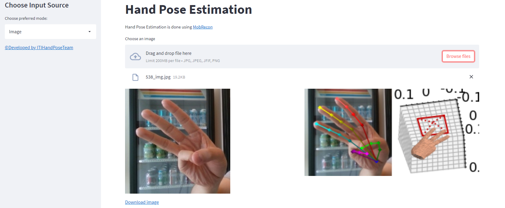
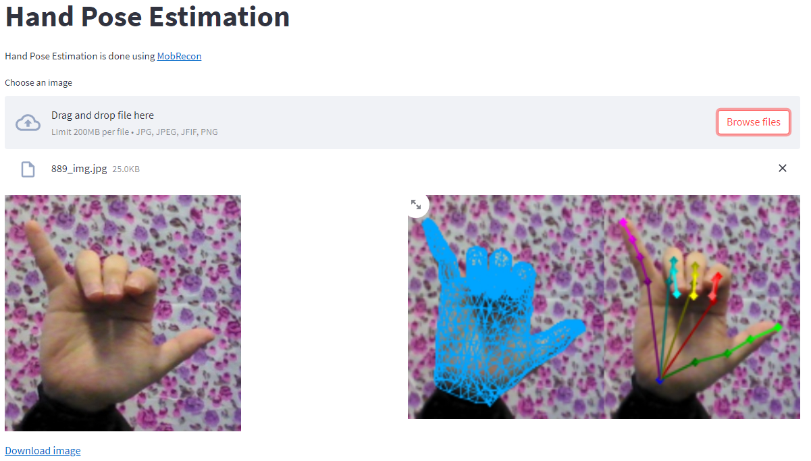

# Hand Mesh Reconstruction


## Introduction
This repo is a PyTorch implementation of hand mesh reconstruction described in [MobRecon](https://arxiv.org/abs/2112.02753). The code was forked from [SeanChenxy/HandMesh](https://github.com/SeanChenxy/HandMesh) and modified to run on a local server using Streamlit server.


## Install 
+ Create environment on Linux or WSL
    ```
    conda create -n handmesh python=3.6
    conda activate handmesh
    ```
+ Please follow [official suggestions](https://pytorch.org/) to install pytorch and torchvision. We used pytorch=1.7.1, torchvision=0.8.2 as advised in the original repo.
+ Requirements
    ```
    pip install -r requirements.txt
    ```
  If you have difficulty in installing `torch_sparse` etc., please use `whl` file from [here](https://pytorch-geometric.com/whl/).
+ [MPI-IS Mesh](https://github.com/MPI-IS/mesh): We suggest to install this library from the source or use the following commands
  ```
  sudo apt-get install libboost-dev
  pip install git+https://github.com/MPI-IS/mesh.git
  ```

+ Download the files you need from [Google drive](https://drive.google.com/drive/folders/1MIE0Jo01blG6RWo2trQbXlQ92tMOaLx_?usp=sharing).

## Run a demo
+ Prepare pre-trained model as
  ```
  out/FreiHAND/mobrecon/checkpoints/mobrecon_densestack_dsconv.pt  
  ``` 
+ Run
  ```
  streamlit run main.py
  ```
+ Open page using provided url and upload image or video

For the model to give the best results, the input should be RGB square image (Aspect ratio 1:1).
<p align="middle">  


</p>